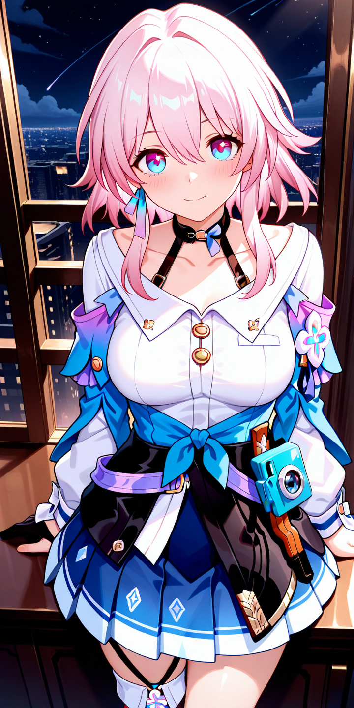
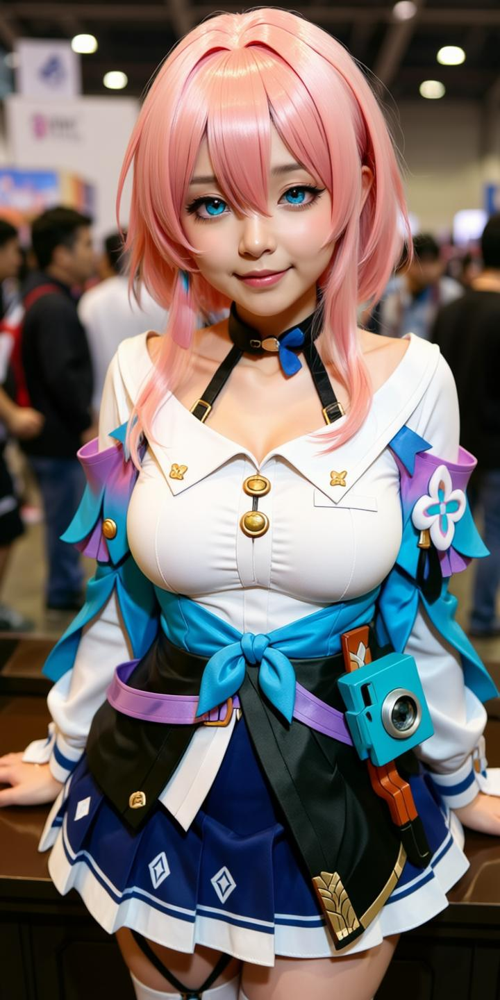
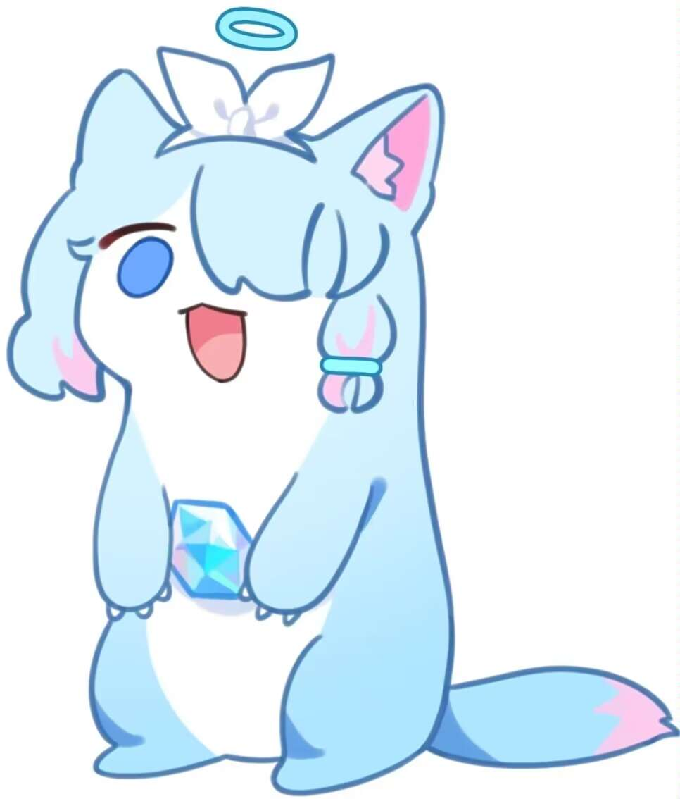
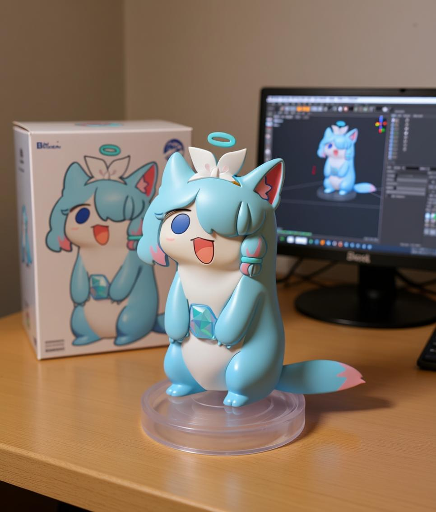
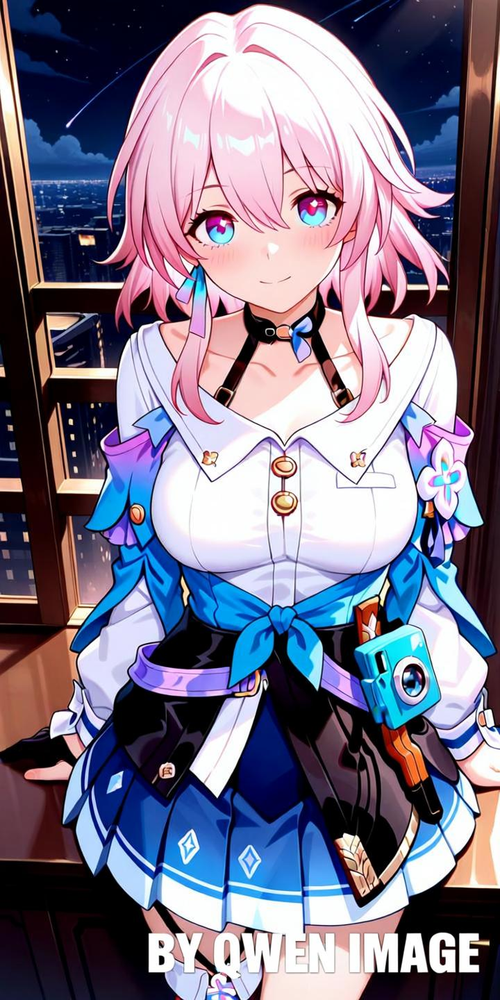
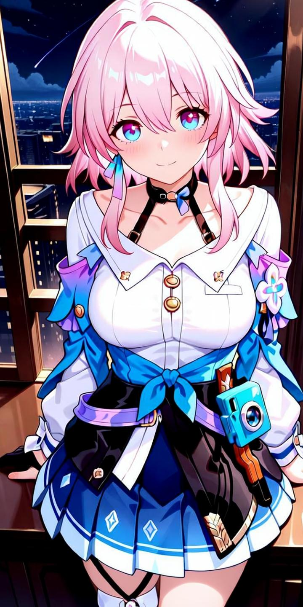
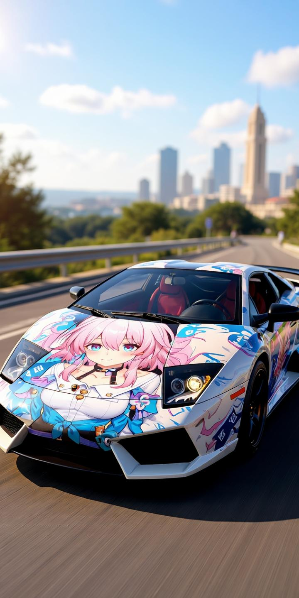

# Awesome Qwen Images ✨

🎉 欢迎来到 Qwen Image 图片精选！

这是一个精选的 Qwen Image 生成图像与提示词合集。借助通义千问团队开源的图像生成模型，全面展示 Qwen Image 在 AI 图像生成与编辑方面的先进能力，并不断探索创意表达的新可能。

案例主要来源于各大 AI 社区 🎬，希望这些案例能为您带来启发 💡，为你的灵感加速 🚀。

部分提示词参考了 [Awesome-Nano-Banana-images](https://github.com/PicoTrex/Awesome-Nano-Banana-images)和 [awesome-nano-banana-images](https://github.com/githubssg/awesome-nano-banana-images)，它们是 Gemini-2.5-Flash-Image（也称为 Nano Banana）生成图像与提示词合集，但Qwen-Image 模型与 Gemini-2.5-Flash-Image 模型生成有较大差异，本集合展示的为Qwen Image 模型生成的图片。

💡 Qwen Image 生成图像使用了 [魔搭AIGC](https://modelscope.cn/aigc/imageGeneration) ，每天有200次生图次数，在此表示感谢！

有什么好的想法？欢迎提 issue 讨论 😊

→ 喜欢就点 Star 支持！ / Smash that ⭐ if you like it!

## 案例

- [Awesome Qwen Images ✨](#awesome-qwen-images-)
  - [案例](#案例)
    - [例 1: \[插画变Coser\]](#例-1-插画变coser)
    - [例 2: \[插画变手办\]](#例-2-插画变手办)
    - [例 3: \[图片加水印\]](#例-3-图片加水印)
    - [例 4: \[图片去水印\]](#例-4-图片去水印)
    - [例 5: \[插画变痛车\]](#例-5-插画变痛车)

### 例 1: [插画变Coser]

| 输入 | 输出 |
|:---:|:---:|
|  |  |

**输入:** 需上传一张参考图片

**提示词:**

```
用图片修改工具生成一张非常详细的完全真实的照片，一个真实的女孩在漫展 cosplay 这个插图，调整五官比例使其更自然。完全复制与原始插图中相同的(总结角色的睁眼闭眼状态填在这里，如睁眼/闭眼/wink)状态、脸型、肤色、面部表情、姿势和相机取景。保持同样的色调，风格，角度，视角，构图，不要有任何偏差。
```

### 例 2: [插画变手办]

| 输入 | 输出 |
|:---:|:---:|
|  |  |

**输入:** 需上传一张参考图片

**提示词:**

```
请将这张照片主体变为手办材质。在手办后方放置一个印有角色形象的盒子。在盒子旁边添加一台电脑，屏幕上显示Blender建模过程。在盒子前方添加一个圆形塑料底座，让手办站立在上面。底座的PVC材料应具有水晶般清澈的半透明质感，并将整个场景设置在室内。
```

### 例 3: [图片加水印]

| 输入 | 输出 |
|:---:|:---:|
|  |  |

**输入:** 需上传一张参考图片

**提示词:**

```
在画面加上的文字水印，水印文字为“BY QWEN IMAGE”，水印文字颜色为白色，带有透明度，水印文字位置为画面底部的右下角，大小为图像分辨率的五十分之一。
```


### 例 4: [图片去水印]

| 输入 | 输出 |
|:---:|:---:|
|  |  |

**输入:** 需上传一张参考图片

**提示词:**

```
把画面的水印去掉
```

### 例 5: [插画变痛车]

| 输入 | 输出 |
|:---:|:---:|
|  |  |

**输入:** 需上传一张参考图片

**提示词:**

```
基于输入的动漫人物图像，生成一张“痛车”风格的跑车图片。将动漫人物以高质量、鲜艳生动的形式绘制在跑车车身，作为完整的车身彩绘图案，体现出典型的“痛车”设计风格。人物图案需保持原作风格，同时适应车身曲面，构图自然、贴合，视觉效果逼真。背景为自然光线充足的知名旅游景点或地标，跑车摆放位置合理，构图干净富有动感。运用专业汽车摄影风格，适当运用景深和光影效果，使车辆与图案融合自然，整车画面具有强烈的视觉冲击力和宣传吸引力，适合用于粉丝向推广或旅游文化营销。
```

[](https://www.star-history.com/#PicoTrex/lfhy/awesome-qwen-images&Date)