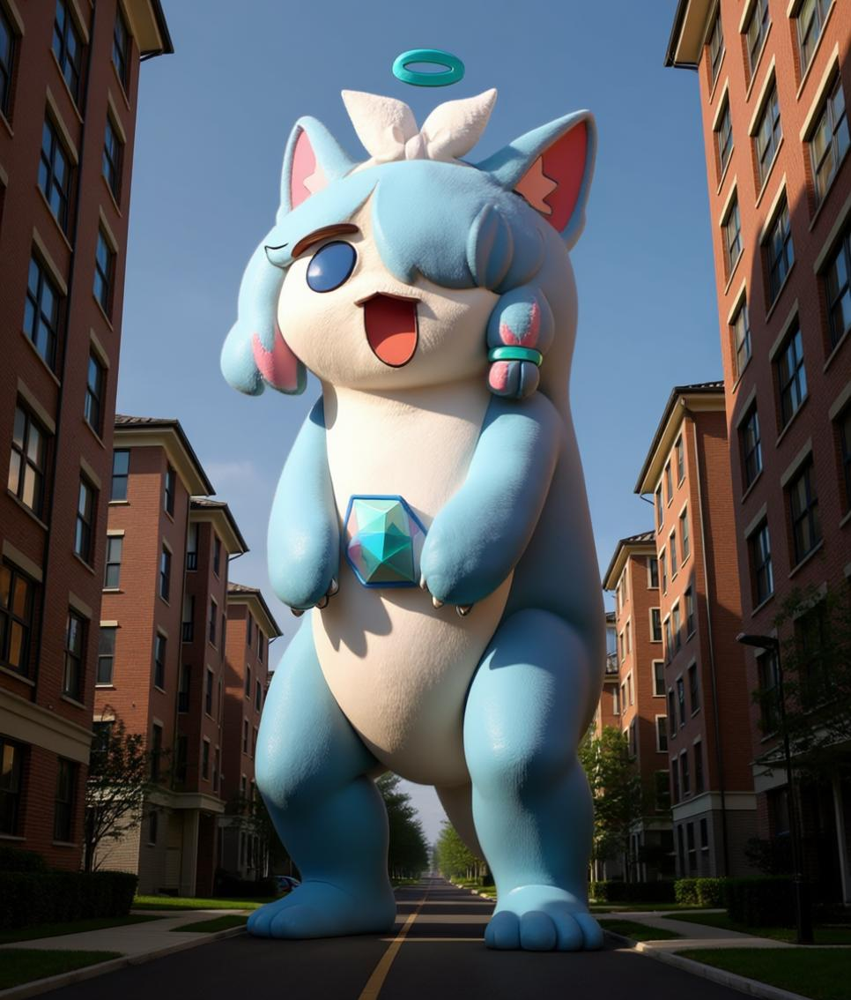

# Awesome Qwen Images ✨

🎉 Welcome to the Qwen Image Gallery!

This is a curated collection of images and prompts generated by Qwen Image. Powered by the open-source image generation model from the Qwen team, this gallery showcases the advanced capabilities of Qwen Image in AI image generation and editing, continuously exploring new possibilities for creative expression.

Most cases are sourced from major AI communities 🎬, and we hope these examples will inspire you 💡 and accelerate your creative ideas 🚀.

Some prompts reference [Awesome-Nano-Banana-images](https://github.com/PicoTrex/Awesome-Nano-Banana-images) and [awesome-nano-banana-images](https://github.com/githubssg/awesome-nano-banana-images), which are image and prompt collections generated by the Gemini-2.5-Flash-Image (also known as Nano Banana) model. However, there are significant differences between the Qwen-Image model and the Gemini-2.5-Flash-Image model, and this collection showcases images generated by the Qwen Image model.

💡 Qwen Image-generated images use [ModelScope AIGC](https://modelscope.cn/aigc/imageGeneration), which provides 200 image generation attempts per day. Thanks for this support!

Have any great ideas? Feel free to open an issue for discussion 😊

→ Like it? Star it to show your support! / Smash that ⭐ if you like it!

## Examples

- [Awesome Qwen Images ✨](#awesome-qwen-images-)
  - [Examples](#examples)
    - [Example 1: \[Illustration to Cosplayer\]](#example-1-illustration-to-cosplayer)
    - [Example 2: \[Illustration to Figurine\]](#example-2-illustration-to-figurine)
    - [Example 3: \[Add Watermark to Image\]](#example-3-add-watermark-to-image)
    - [Example 4: \[Remove Watermark from Image\]](#example-4-remove-watermark-from-image)
    - [Example 5: \[Illustration to Decorated Car\]](#example-5-illustration-to-decorated-car)
    - [Example 6: \[Giant Transformation\]](#example-6-giant-transformation)

### Example 1: [Illustration to Cosplayer]

| Input | Output |
|:---:|:---:|
|  |  |

**Input:** An input reference image is required

**Prompt (English translation of Chinese prompt):**

```
Generate a highly detailed, completely realistic photo using an image editing tool, showing a real girl cosplaying this illustration at a convention. Adjust the facial features ratio to make it more natural. Exactly replicate the same eye state (summarize whether the character's eyes are open/closed/winking in the original illustration and fill it in here), face shape, skin tone, facial expression, pose, and camera framing as in the original illustration. Maintain the same tone, style, angle, viewpoint, and composition without any deviation.
```

**Original Chinese Prompt:**

```
用图片修改工具生成一张非常详细的完全真实的照片，一个真实的女孩在漫展 cosplay 这个插图，调整五官比例使其更自然。完全复制与原始插图中相同的(总结角色的睁眼闭眼状态填在这里，如睁眼/闭眼/wink)状态、脸型、肤色、面部表情、姿势和相机取景。保持同样的色调，风格，角度，视角，构图，不要有任何偏差。
```

### Example 2: [Illustration to Figurine]

| Input | Output |
|:---:|:---:|
|  |  |

**Input:** An input reference image is required

**Prompt (English translation of Chinese prompt):**

```
Please change the main subject of this photo to figurine material. Place a box with the character's image printed on it behind the figurine. Add a computer next to the box with the Blender modeling process displayed on the screen. Add a circular plastic base in front of the box for the figurine to stand on. The PVC material of the base should have a crystal-clear, translucent quality, and set the entire scene indoors.
```

**Original Chinese Prompt:**

```
请将这张照片主体变为手办材质。在手办后方放置一个印有角色形象的盒子。在盒子旁边添加一台电脑，屏幕上显示Blender建模过程。在盒子前方添加一个圆形塑料底座，让手办站立在上面。底座的PVC材料应具有水晶般清澈的半透明质感，并将整个场景设置在室内。
```

### Example 3: [Add Watermark to Image]

| Input | Output |
|:---:|:---:|
|  |  |

**Input:** An input reference image is required

**Prompt (English translation of Chinese prompt):**

```
Add a text watermark to the image with the text "BY QWEN IMAGE". The watermark text color should be white with transparency. Position the watermark text at the bottom right corner of the image, with a size of one-fiftieth of the image resolution.
```

**Original Chinese Prompt:**

```
在画面加上的文字水印，水印文字为"BY QWEN IMAGE"，水印文字颜色为白色，带有透明度，水印文字位置为画面底部的右下角，大小为图像分辨率的五十分之一。
```

### Example 4: [Remove Watermark from Image]

| Input | Output |
|:---:|:---:|
|  |  |

**Input:** An input reference image is required

**Prompt (English translation of Chinese prompt):**

```
Remove the watermark from the image
```

**Original Chinese Prompt:**

```
把画面的水印去掉
```

### Example 5: [Illustration to Decorated Car]

| Input | Output |
|:---:|:---:|
|  |  |

**Input:** An input reference image is required

**Prompt (English translation of Chinese prompt):**

```
Based on the input anime character image, generate a sports car image in a "decorated car" (also known as "痛车" in Japanese) style. Draw the anime character in high quality with vivid colors on the car body as a complete body wrap design, reflecting the typical "decorated car" design style. The character pattern should maintain the original style while adapting to the car's curved surfaces, with a natural and well-fitted composition that creates a realistic visual effect. Set the background at a well-known tourist attraction or landmark with ample natural lighting. Position the car appropriately with a clean and dynamic composition. Apply professional automotive photography styles with appropriate depth of field and lighting effects to naturally blend the vehicle with the pattern. The overall image should have strong visual impact and promotional appeal, suitable for fan-oriented promotion or tourism and cultural marketing.
```

**Original Chinese Prompt:**

```
基于输入的动漫人物图像，生成一张"痛车"风格的跑车图片。将动漫人物以高质量、鲜艳生动的形式绘制在跑车车身，作为完整的车身彩绘图案，体现出典型的"痛车"设计风格。人物图案需保持原作风格，同时适应车身曲面，构图自然、贴合，视觉效果逼真。背景为自然光线充足的知名旅游景点或地标，跑车摆放位置合理，构图干净富有动感。运用专业汽车摄影风格，适当运用景深和光影效果，使车辆与图案融合自然，整车画面具有强烈的视觉冲击力和宣传吸引力，适合用于粉丝向推广或旅游文化营销。
```

### Example 6: [Giant Transformation]

| Input | Output |
|:---:|:---:|
|  |  |

**Input:** An input reference image is required

**Prompt (English translation of Chinese prompt):**

```
Extract the main character from the image and apply "giant transformation" processing, making the character the same scale as the surrounding residential buildings, with a height comparable to the buildings, creating a strong sense of oppression and visual impact. Set the scene in a real-style residential community, surrounded by real buildings, roads, and green facilities, maintaining normal urban environmental proportions. Keep the character and background perspective consistent, using a low-angle upward shot to enhance the impact of the giant figure. The overall image should be rich in details, presenting photo-realistic quality, combined with cinematic lighting effects, such as dramatic shadows and strong light contrasts, to further enhance the atmosphere and visual performance, suitable for concept art, visual effects, or creative promotional materials.
```

**Original Chinese Prompt:**

```
将图片中的主体人物进行抠图并进行"巨人化"处理，使该人物与周围小区建筑处于同一比例，高度与楼房相当，营造出强烈的压迫感和视觉震撼。场景设定为一个现实风格的住宅小区，周围环绕着真实的楼房、道路与绿化设施，保持正常的城市环境比例。人物与背景视角保持一致，采用低角度仰视镜头，增强巨人形象的冲击力。整体画面细节丰富，呈现照片级真实质感，结合电影级灯光效果，如戏剧性阴影与强光对比，进一步提升氛围感与视觉表现力，适合用于概念艺术、视觉特效或创意宣传素材。
```

[](https://www.star-history.com/#PicoTrex/lfhy/awesome-qwen-images&Date)