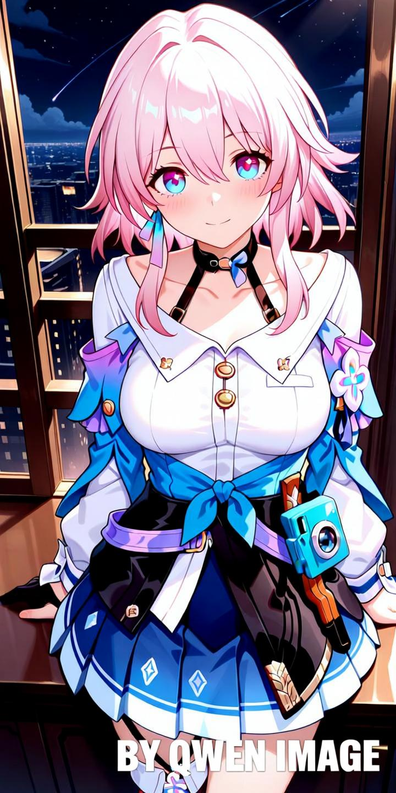

# Awesome Qwen Images ✨

🎉 Welcome to the Qwen Image Gallery!

This is a curated collection of images and prompts generated by Qwen Image. Powered by the open-source image generation model from the Qwen team, this gallery showcases the advanced capabilities of Qwen Image in AI image generation and editing, continuously exploring new possibilities for creative expression.

Most cases are sourced from major AI communities 🎬, and we hope these examples will inspire you 💡 and accelerate your creative ideas 🚀.

Some prompts reference [Awesome-Nano-Banana-images](https://github.com/PicoTrex/Awesome-Nano-Banana-images) and [awesome-nano-banana-images](https://github.com/githubssg/awesome-nano-banana-images), which are image and prompt collections generated by the Gemini-2.5-Flash-Image (also known as Nano Banana) model. However, there are significant differences between the Qwen-Image model and the Gemini-2.5-Flash-Image model, and this collection showcases images generated by the Qwen Image model.

💡 Qwen Image-generated images use [ModelScope AIGC](https://modelscope.cn/aigc/imageGeneration), which provides 200 image generation attempts per day. Thanks for this support!

Have any great ideas? Feel free to open an issue for discussion 😊

→ Like it? Star it to show your support! / Smash that ⭐ if you like it!

## Examples

- [Awesome Qwen Images ✨](#awesome-qwen-images-)
  - [Examples](#examples)
    - [Example 1: [Illustration to Cosplayer]](#example-1-illustration-to-cosplayer)
    - [Example 2: [Illustration to Figurine]](#example-2-illustration-to-figurine)
    - [Example 3: [Add Watermark to Image]](#example-3-add-watermark-to-image)
    - [Example 4: [Remove Watermark from Image]](#example-4-remove-watermark-from-image)
    - [Example 5: [Illustration to Decorated Car]](#example-5-illustration-to-decorated-car)

### Example 1: [Illustration to Cosplayer]

| Input | Output |
|:---:|:---:|
|  |  |

**Input:** An input reference image is required

**Prompt:**

```
Generate a highly detailed, completely realistic photo using an image editing tool, showing a real girl cosplaying this illustration at a convention. Adjust the facial features ratio to make it more natural. Exactly replicate the same eye state (summarize whether the character's eyes are open/closed/winking in the original illustration and fill it in here), face shape, skin tone, facial expression, pose, and camera framing as in the original illustration. Maintain the same tone, style, angle, viewpoint, and composition without any deviation.
```

### Example 2: [Illustration to Figurine]

| Input | Output |
|:---:|:---:|
|  |  |

**Input:** An input reference image is required

**Prompt:**

```
Please change the main subject of this photo to figurine material. Place a box with the character's image printed on it behind the figurine. Add a computer next to the box with the Blender modeling process displayed on the screen. Add a circular plastic base in front of the box for the figurine to stand on. The PVC material of the base should have a crystal-clear, translucent quality, and set the entire scene indoors.
```

### Example 3: [Add Watermark to Image]

| Input | Output |
|:---:|:---:|
|  |  |

**Input:** An input reference image is required

**Prompt:**

```
Add a text watermark to the image with the text "BY QWEN IMAGE". The watermark text color should be white with transparency. Position the watermark text at the bottom right corner of the image, with a size of one-fiftieth of the image resolution.
```

### Example 4: [Remove Watermark from Image]

| Input | Output |
|:---:|:---:|
|  |  |

**Input:** An input reference image is required

**Prompt:**

```
Remove the watermark from the image
```

### Example 5: [Illustration to Decorated Car]

| Input | Output |
|:---:|:---:|
|  |  |

**Input:** An input reference image is required

**Prompt:**

```
Based on the input anime character image, generate a sports car image in a "decorated car" (also known as "痛车" in Japanese) style. Draw the anime character in high quality with vivid colors on the car body as a complete body wrap design, reflecting the typical "decorated car" design style. The character pattern should maintain the original style while adapting to the car's curved surfaces, with a natural and well-fitted composition that creates a realistic visual effect. Set the background at a well-known tourist attraction or landmark with ample natural lighting. Position the car appropriately with a clean and dynamic composition. Apply professional automotive photography styles with appropriate depth of field and lighting effects to naturally blend the vehicle with the pattern. The overall image should have strong visual impact and promotional appeal, suitable for fan-oriented promotion or tourism and cultural marketing.
```

[](https://www.star-history.com/#PicoTrex/lfhy/awesome-qwen-images&Date)